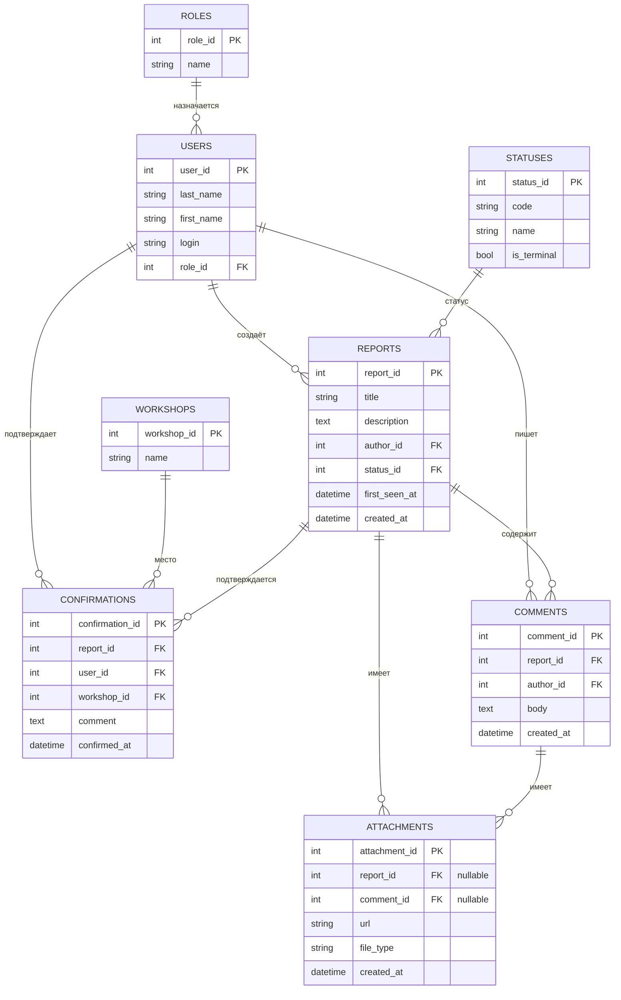

# MayakBackend
Это репозиторий с кодом сервера для MayakDefect.

## Стек технологий
- FastAPI
- SQL Alchemy
- Pydantic
- Elasticsearch

## Техдолг
- Валидация паролей методами pydantic

## ERD

```mermaid
erDiagram
    ROLES ||--o{ USERS : "назначается"
    USERS ||--o{ REPORTS : "создаёт"
    USERS ||--o{ CONFIRMATIONS : "подтверждает"
    USERS ||--o{ COMMENTS : "пишет"
    WORKSHOPS ||--o{ CONFIRMATIONS : "место"
    STATUSES ||--o{ REPORTS : "статус"
    REPORTS ||--o{ CONFIRMATIONS : "подтверждается"
    REPORTS ||--o{ ATTACHMENTS : "имеет"
    REPORTS ||--o{ COMMENTS : "содержит"
    COMMENTS ||--o{ ATTACHMENTS : "имеет"

    ROLES {
        int role_id PK
        string name
    }
    USERS {
        int user_id PK
        string last_name
        string first_name
        string login
        int role_id FK
    }
    WORKSHOPS {
        int workshop_id PK
        string name
    }
    STATUSES {
        int status_id PK
        string code
        string name
        bool is_terminal
    }
    REPORTS {
        int report_id PK
        string title
        text description
        int author_id FK
        int status_id FK
        datetime first_seen_at
        datetime created_at
    }
    CONFIRMATIONS {
        int confirmation_id PK
        int report_id FK
        int user_id FK
        int workshop_id FK
        text comment
        datetime confirmed_at
    }
    ATTACHMENTS {
        int attachment_id PK
        int report_id FK "nullable"
        int comment_id FK "nullable"
        string url
        string file_type
        datetime created_at
    }
    COMMENTS {
        int comment_id PK
        int report_id FK
        int author_id FK
        text body
        datetime created_at
    }
```